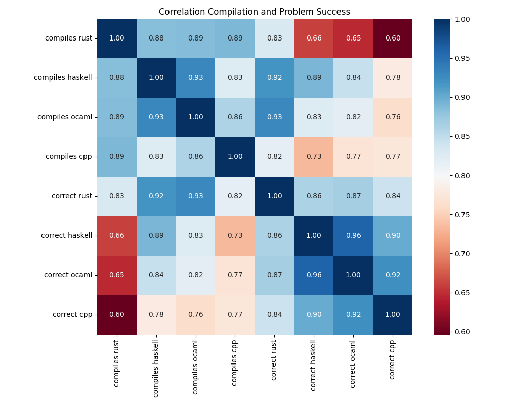
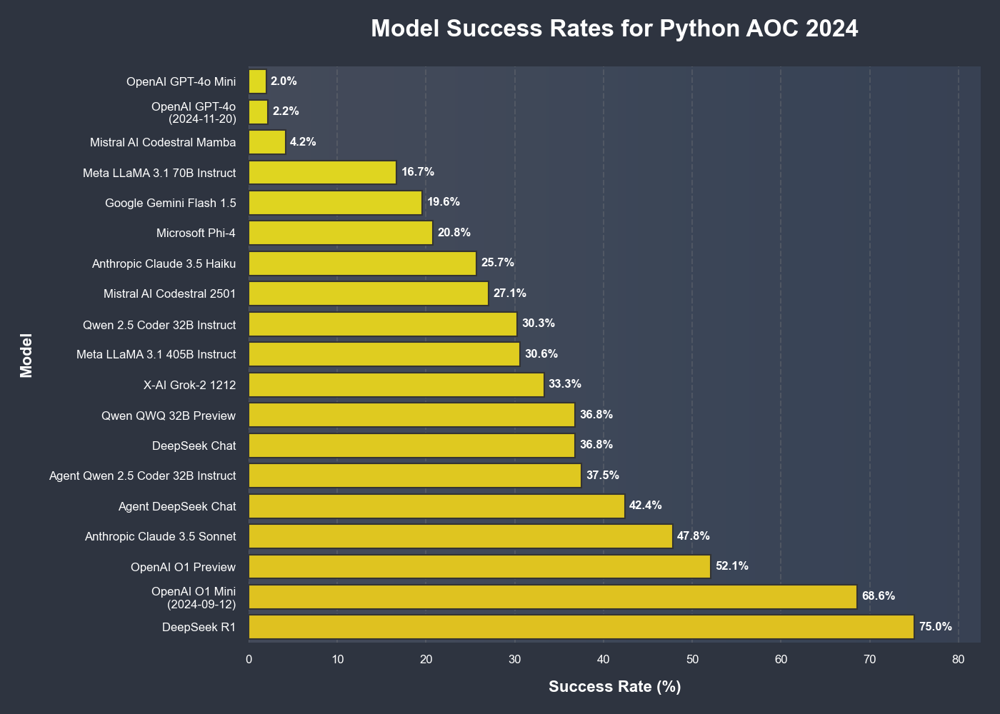
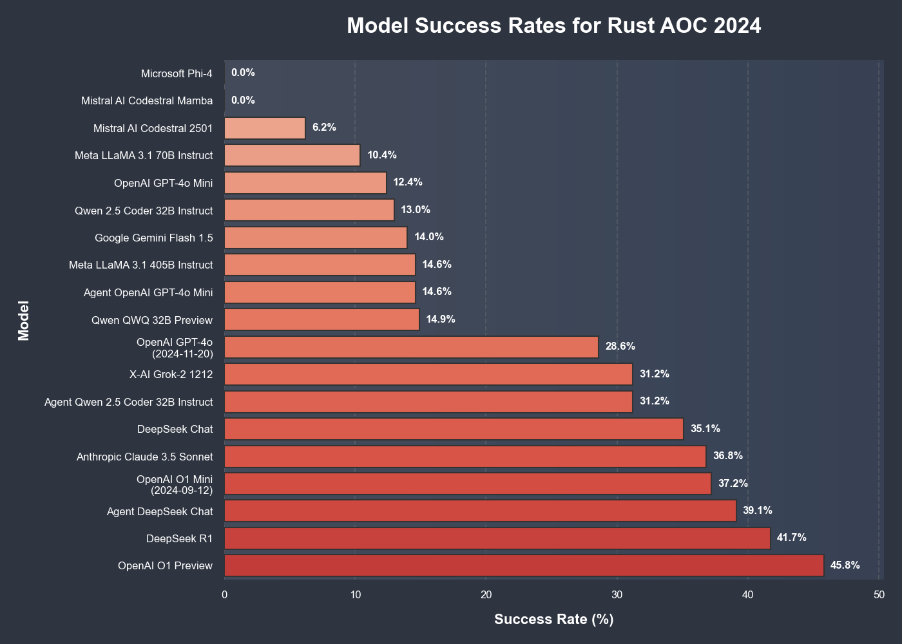
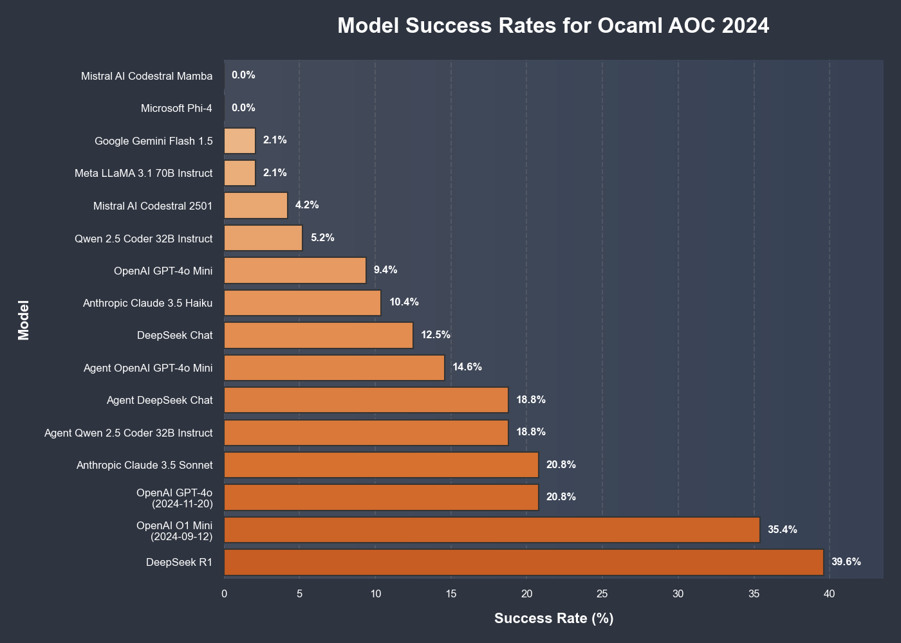
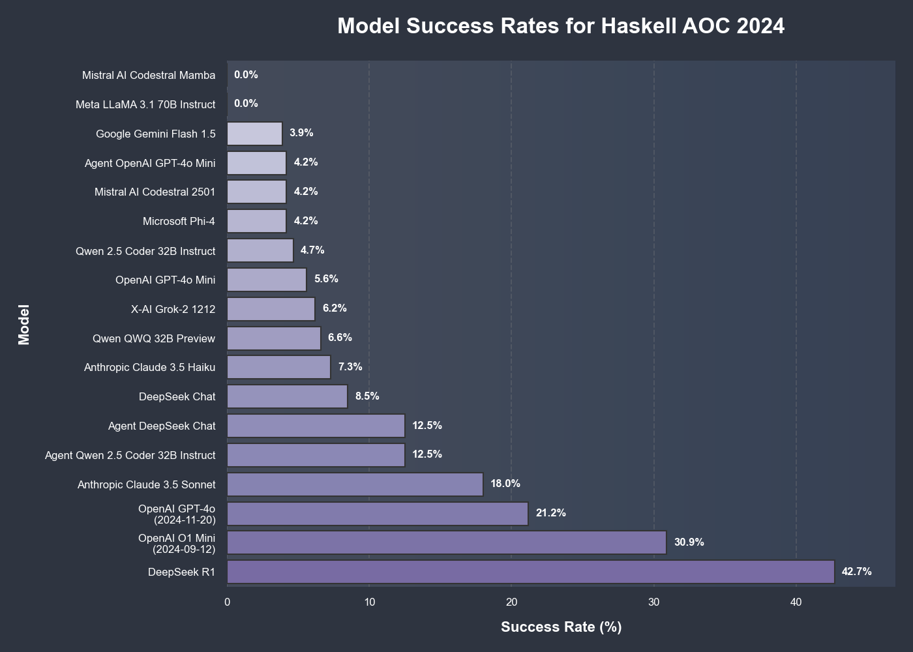
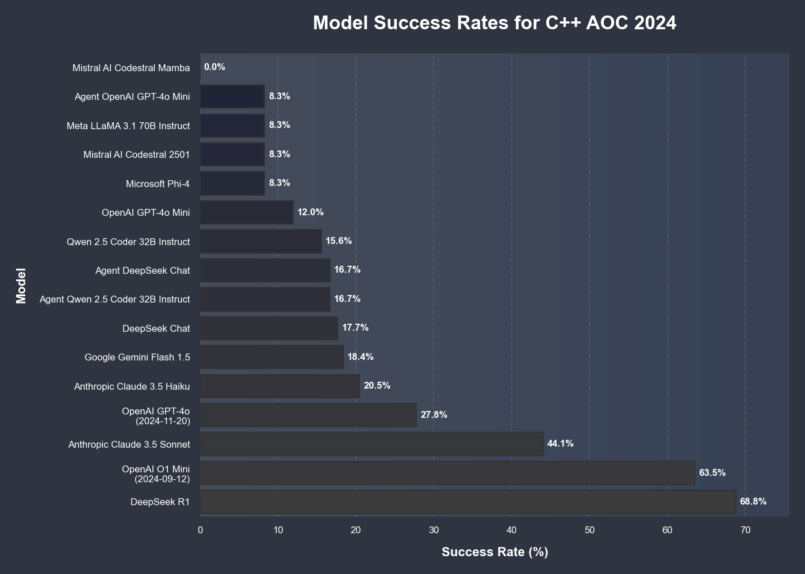
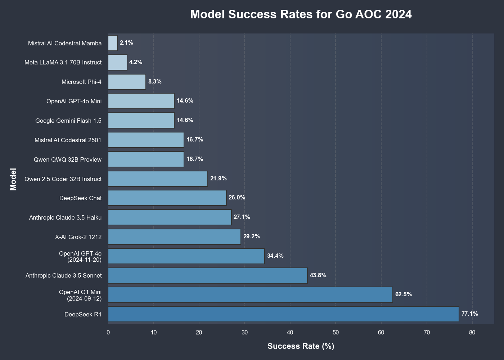

# Compilation Benchmark #

Work in progress

This repo extends what I started in [rust-bench](https://github.com/Gusanidas/rust-bench), I am interested in comparing how different llms perform at writing code that compiles, and how that relates to the code working correctly.

I have used some problems written by hand, and the problems from the advent of code 2024, hoping that they were not in the training data.
From the AOC problems, I havent uploaded my inputs and outputs.

## Correlations ##

Looking at the correlation between how often a problem compiles and is correct in different languages, it seems plausible that writing code that compiles requires a slightly different skill from solving the problem with code.
Writing Haskell code that compiles correlates more with writing Ocaml code that compiles, than with solving the problem in Haskell. 

| | compiles cpp | compiles haskell | compiles ocaml | compiles python | compiles rust | compiles go | avg compiles | correct cpp | correct haskell | correct ocaml | correct python | correct rust | correct go | avg correct |
|---|--:|--:|--:|--:|--:|--:|--:|--:|--:|--:|--:|--:|--:|--:|
| compiles cpp | 1.000 | 0.825 | 0.860 | -0.345 | 0.889 | -0.440 | 0.923 | 0.774 | 0.732 | 0.770 | 0.661 | 0.818 | 0.838 | 0.810 |
| compiles haskell | 0.825 | 1.000 | 0.929 | -0.226 | 0.884 | -0.526 | 0.952 | 0.780 | 0.891 | 0.844 | 0.620 | 0.919 | 0.893 | 0.866 |
| compiles ocaml | 0.860 | 0.929 | 1.000 | -0.361 | 0.886 | -0.592 | 0.953 | 0.763 | 0.826 | 0.820 | 0.642 | 0.928 | 0.859 | 0.845 |
| compiles python | -0.345 | -0.226 | -0.361 | 1.000 | -0.417 | 0.523 | -0.241 | -0.245 | -0.086 | -0.180 | -0.291 | -0.291 | -0.163 | -0.231 |
| compiles rust | 0.889 | 0.884 | 0.886 | -0.417 | 1.000 | -0.702 | 0.950 | 0.596 | 0.659 | 0.646 | 0.489 | 0.830 | 0.743 | 0.707 |
| compiles go | -0.440 | -0.526 | -0.592 | 0.523 | -0.702 | 1.000 | -0.545 | -0.327 | -0.343 | -0.270 | -0.199 | -0.588 | -0.336 | -0.369 |
| avg compiles | 0.923 | 0.952 | 0.953 | -0.241 | 0.950 | -0.545 | 1.000 | 0.753 | 0.806 | 0.816 | 0.609 | 0.912 | 0.874 | 0.841 |
| correct cpp | 0.774 | 0.780 | 0.763 | -0.245 | 0.596 | -0.327 | 0.753 | 1.000 | 0.900 | 0.922 | 0.907 | 0.841 | 0.934 | 0.978 |
| correct haskell | 0.732 | 0.891 | 0.826 | -0.086 | 0.659 | -0.343 | 0.806 | 0.900 | 1.000 | 0.961 | 0.713 | 0.863 | 0.945 | 0.936 |
| correct ocaml | 0.770 | 0.844 | 0.820 | -0.180 | 0.646 | -0.270 | 0.816 | 0.922 | 0.961 | 1.000 | 0.813 | 0.867 | 0.953 | 0.968 |
| correct python | 0.661 | 0.620 | 0.642 | -0.291 | 0.489 | -0.199 | 0.609 | 0.907 | 0.713 | 0.813 | 1.000 | 0.669 | 0.841 | 0.891 |
| correct rust | 0.818 | 0.919 | 0.928 | -0.291 | 0.830 | -0.588 | 0.912 | 0.841 | 0.863 | 0.867 | 0.669 | 1.000 | 0.868 | 0.896 |
| correct go | 0.838 | 0.893 | 0.859 | -0.163 | 0.743 | -0.336 | 0.874 | 0.934 | 0.945 | 0.953 | 0.841 | 0.868 | 1.000 | 0.980 |
| avg correct | 0.810 | 0.866 | 0.845 | -0.231 | 0.707 | -0.369 | 0.841 | 0.978 | 0.936 | 0.968 | 0.891 | 0.896 | 0.980 | 1.000 |

Python and Go are a bit different as most attempts compile correctly.
Focusing only on Rust, Haskell, C++ and Ocaml.

## Some AOC results #

Some graphs comparing the perfromance of different models in Advent of Code 2024

